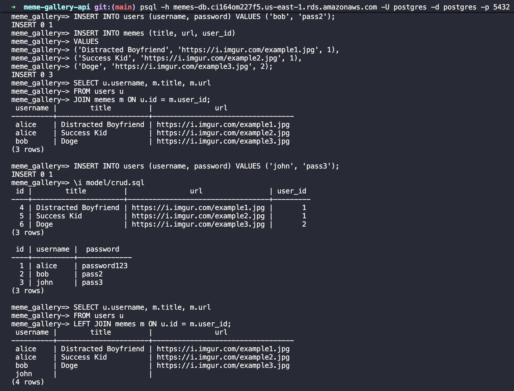
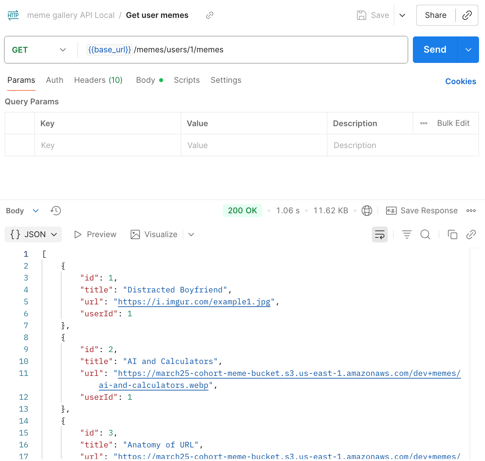
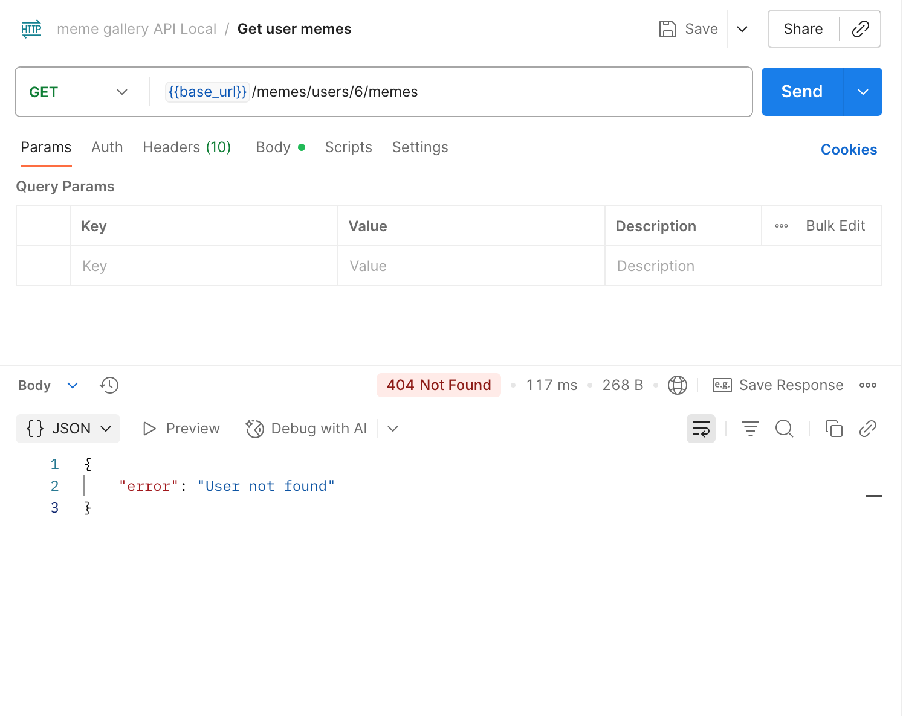
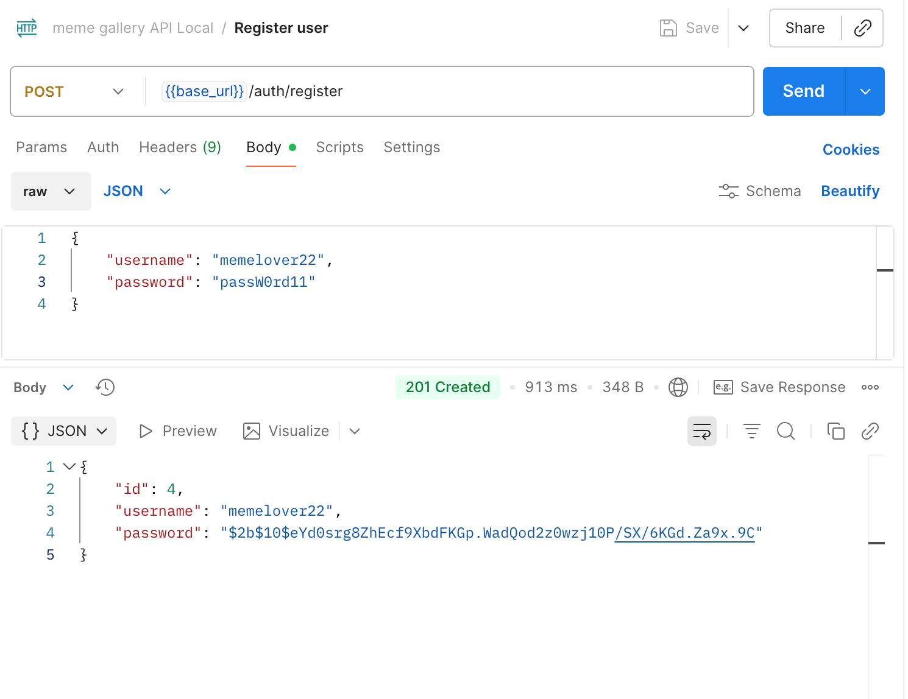
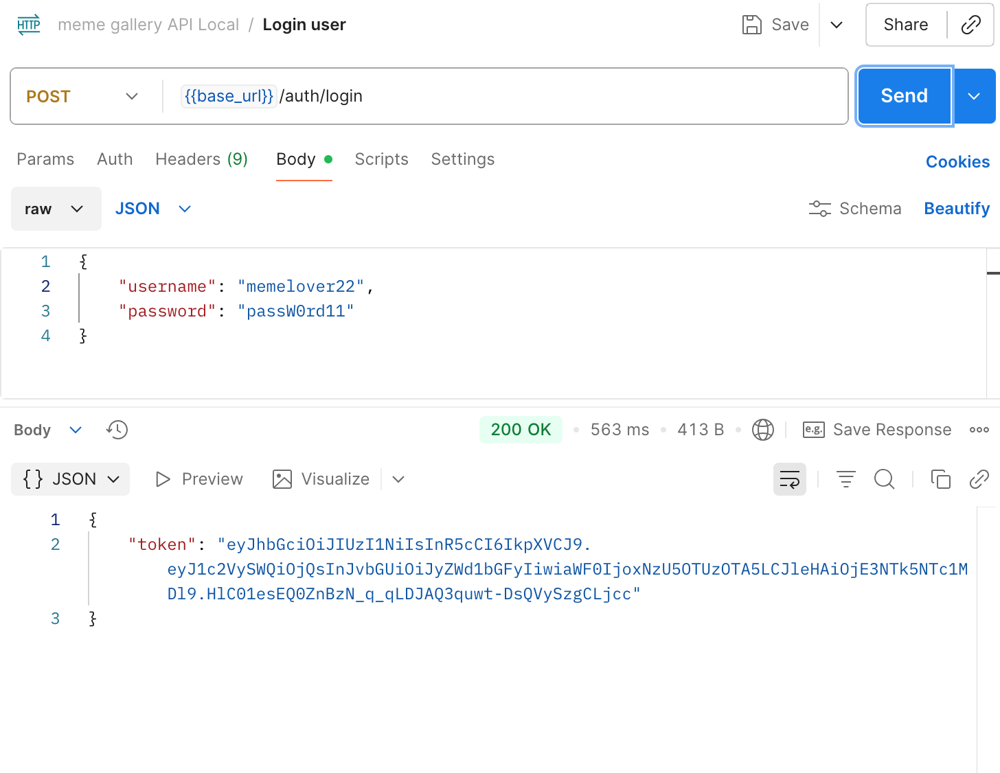
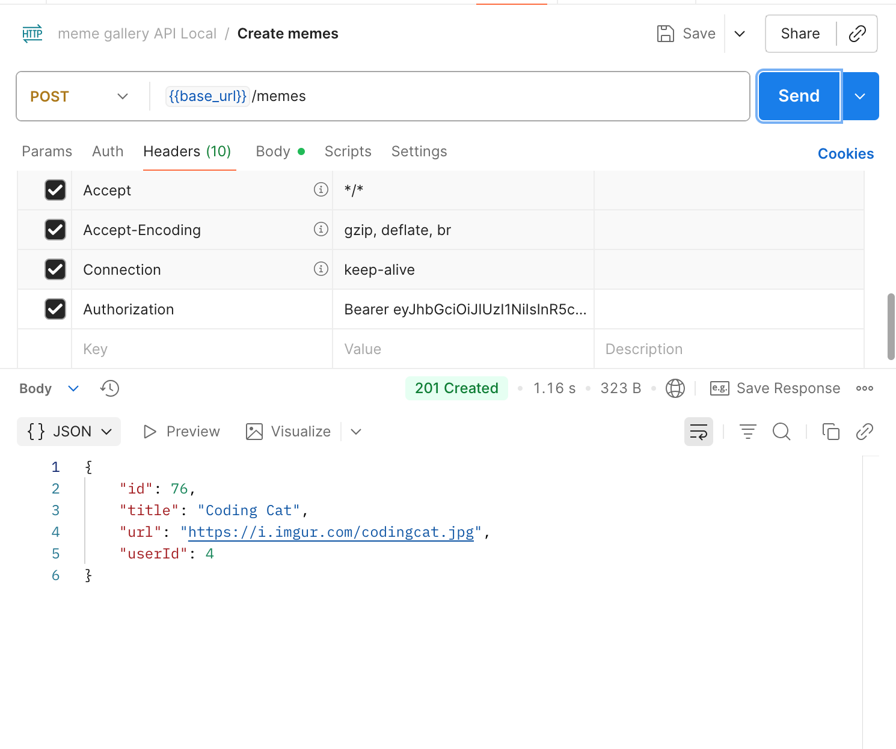
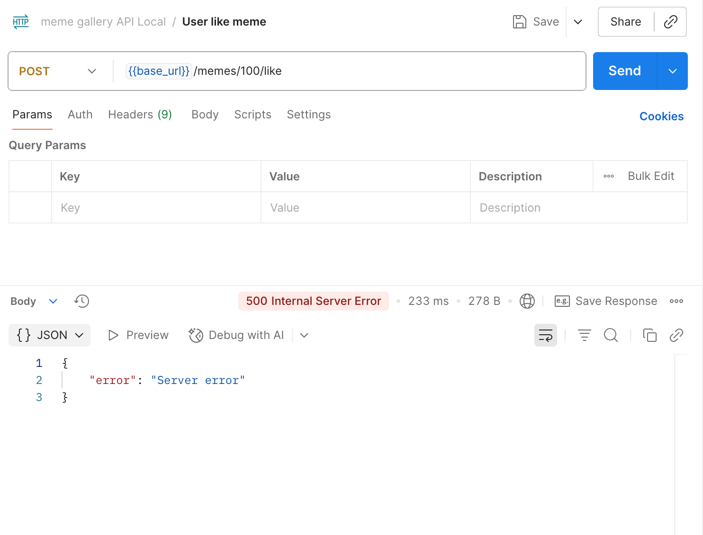

# meme-gallery-api

Setting up an Express server and creating API endpoints using ES6+ features.

## GET memes 

## POST memes

## GET meme by ID

## GET meme by ID error 

## Terminal log requests

## UPDATE meme 

## DELETE meme

## Queries for updating and deleting meme

## Queries for joining users and memes and returning all users

## Returning a user’s memes

## Returning an invalid user’s memes

## User registration

## User login with returned token

## Successful meme creation with JWT

## User like meme

## User unlike meme

## Like/unlike validation error

