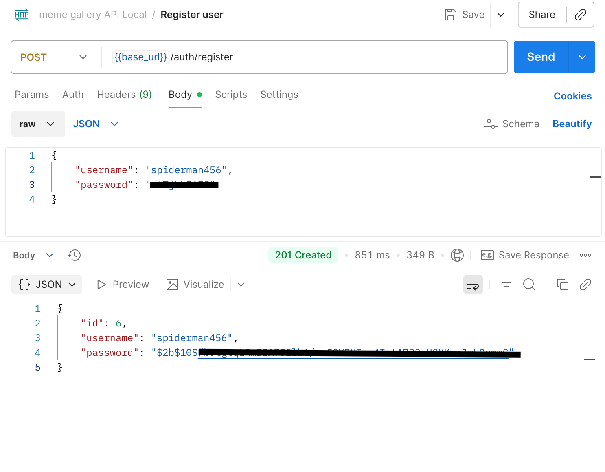
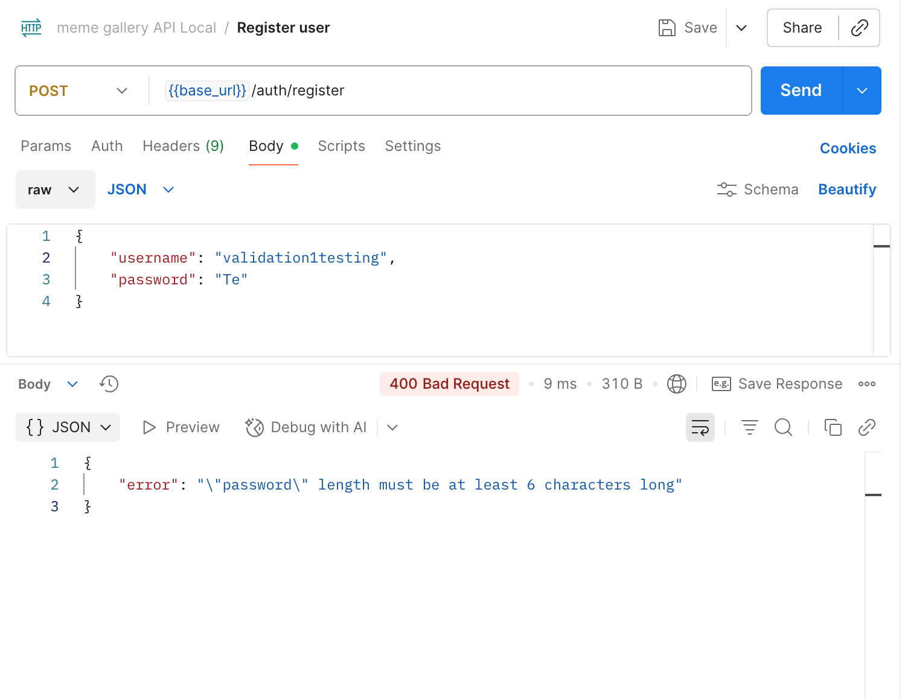
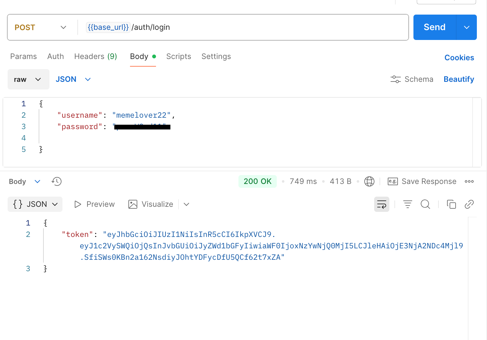
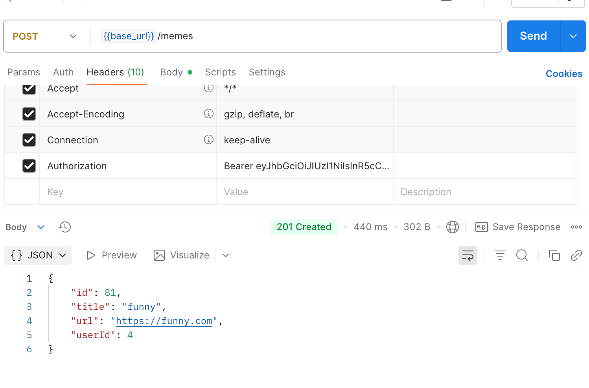
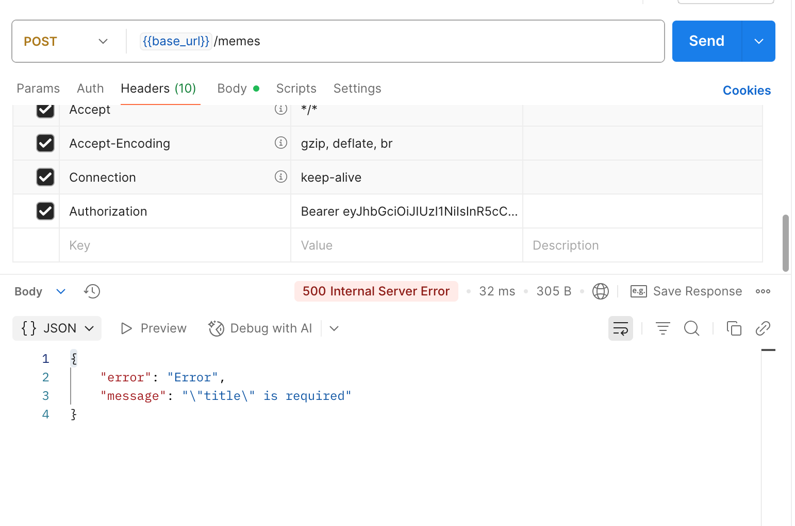
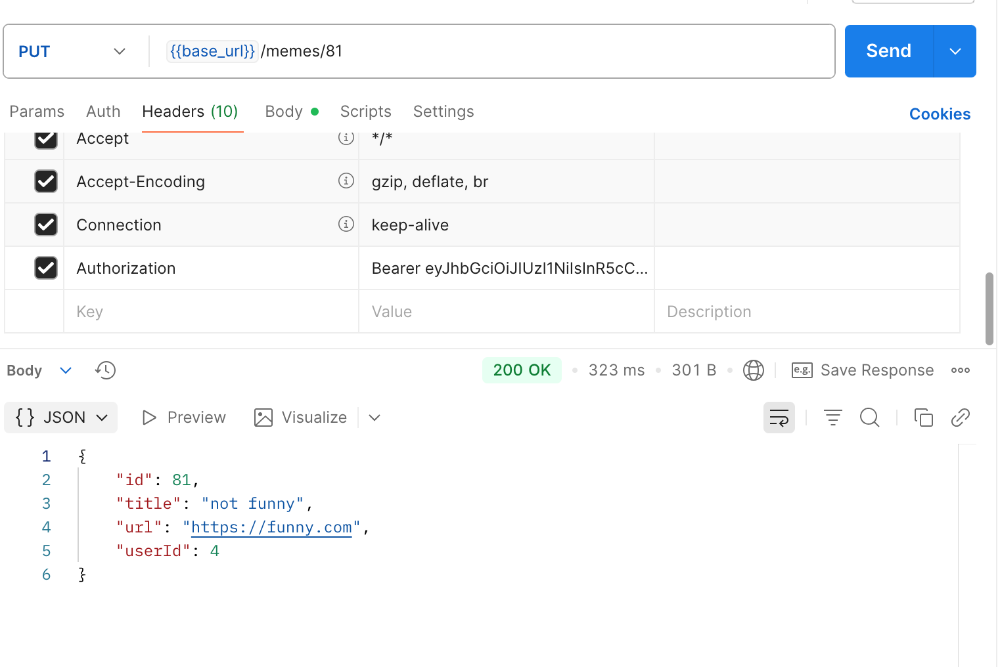
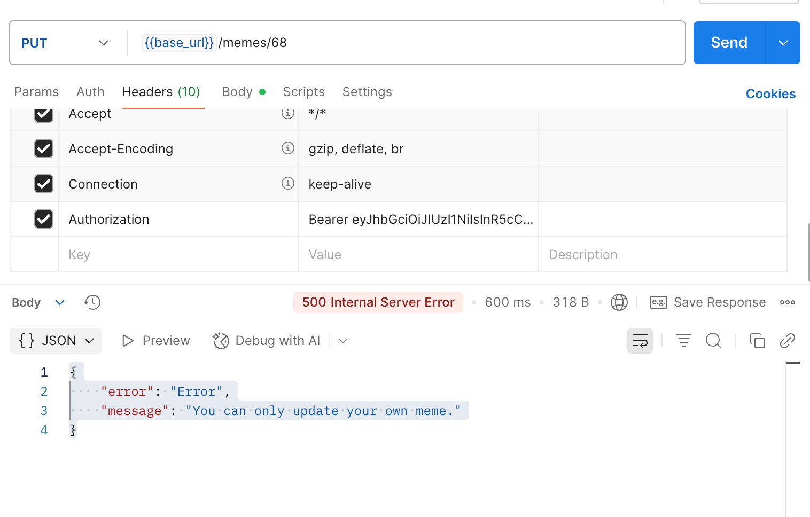
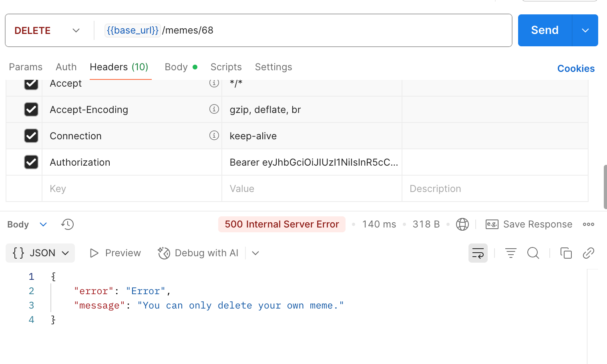
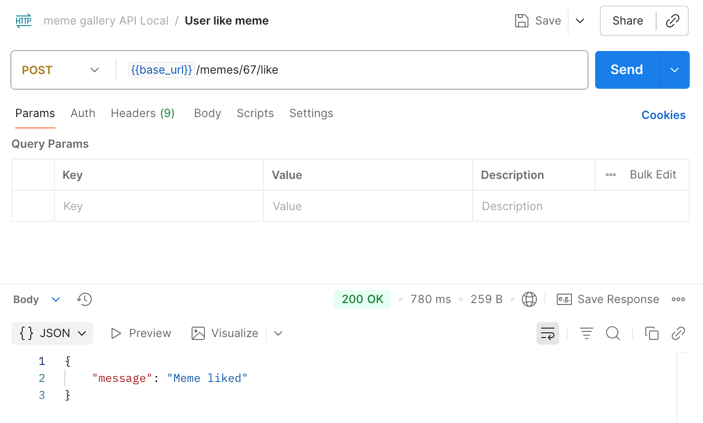
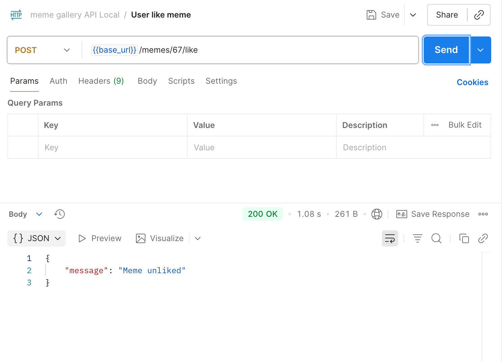

# Meme Gallery API

A CRUD API built with Node.js, Express, Javascript, TypeScript, Prisma, and PostgreSQL (AWS RDS).
This API allows users to register, log in, and manage memes — including creating, updating, liking/unliking, and deleting them.

[Deployment URL](https://meme-gallery-api-4pmz.onrender.com/)

## Project Overview

- Core Features:
- User registration and login (JWT authentication)
- Create, read, update, and delete memes
- Like/unlike memes
- PostgreSQL integration via Prisma ORM
- Deployed using Render

## Local Setup 

env vars  

```
DATABASE_URL=your_postgres_rds_connection_url
PORT=3000
JWT_SECRET=your_jwt_secret
```

scripts in ```package.json```

```
"scripts": {
  "start": "node dist/index.js",
  "dev": "nodemon --loader ts-node/esm src/index.js",
  "build": "tsc -p tsconfig.json"
}
```

## API Docs

**Auth Routes**

POST ```/auth/register```
- Register a new user.



Error




POST ```/auth/login```
- Authenticate user and return a JWT token.




**Meme Routes**

GET ```/memes```
- Retrieve all memes.

GET ```/memes/:id```
- Retrieve a specific meme by ID.

GET ```/memes/users/:id/memes```
- Retrieve all memes created by a specific user.

POST ```/memes```
- Create a new meme (requires JWT).



Error 



PUT ```/memes/:id```
- Update a meme (requires JWT).



Error



DELETE ```/memes/:id```
- Delete a meme (requires JWT).


Error



POST ```/memes/:id/like```
- Like or unlike a meme (requires JWT).





