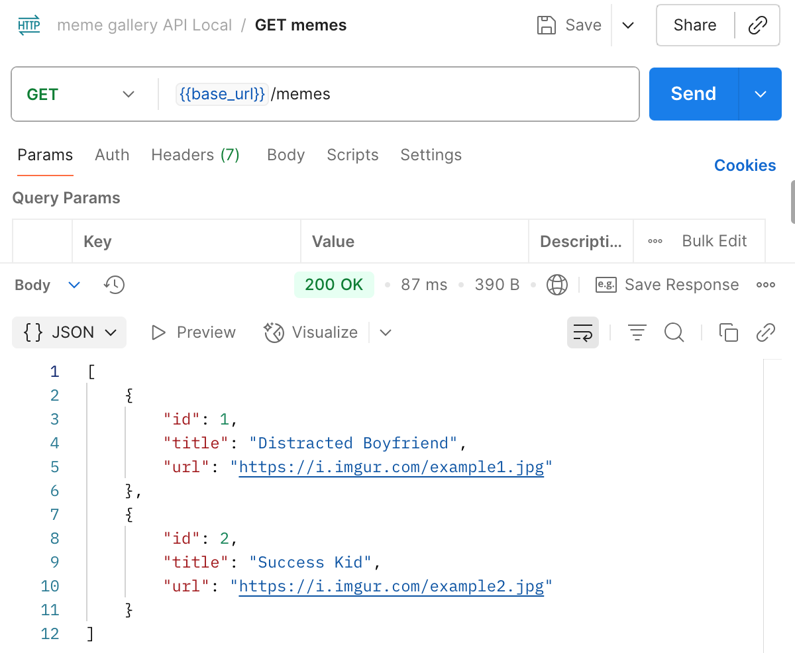
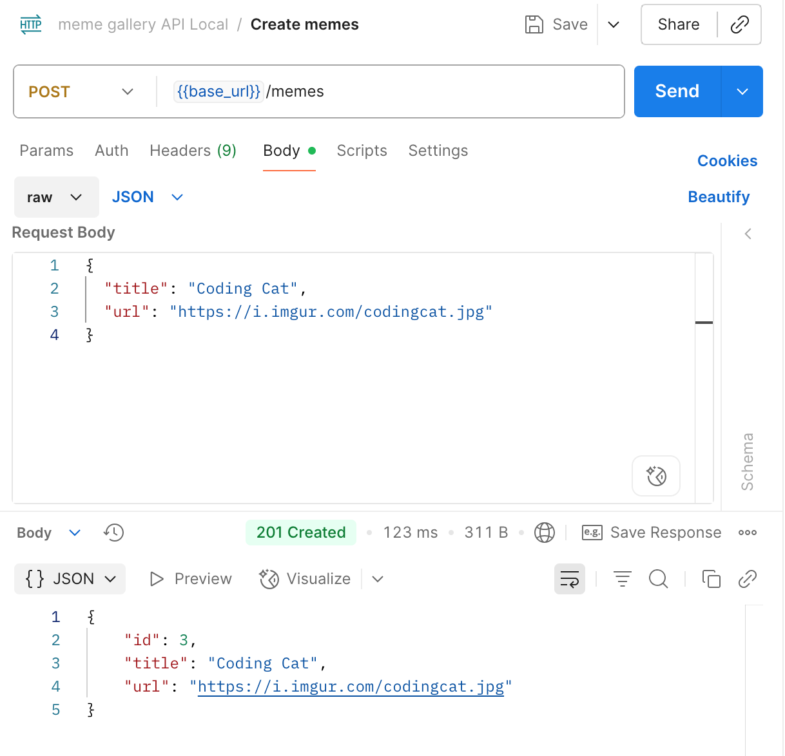
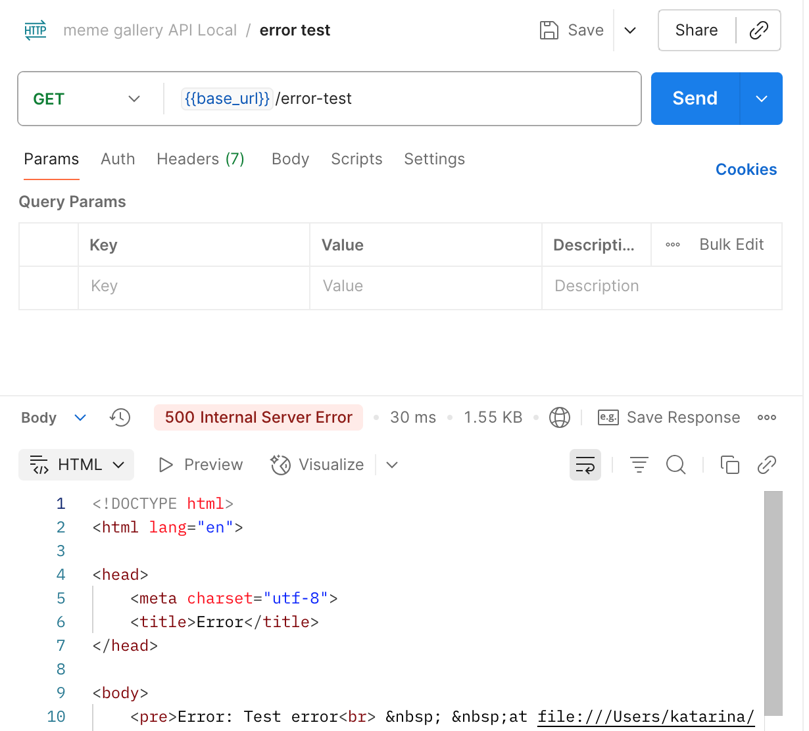
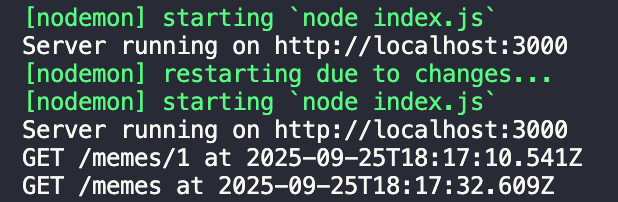
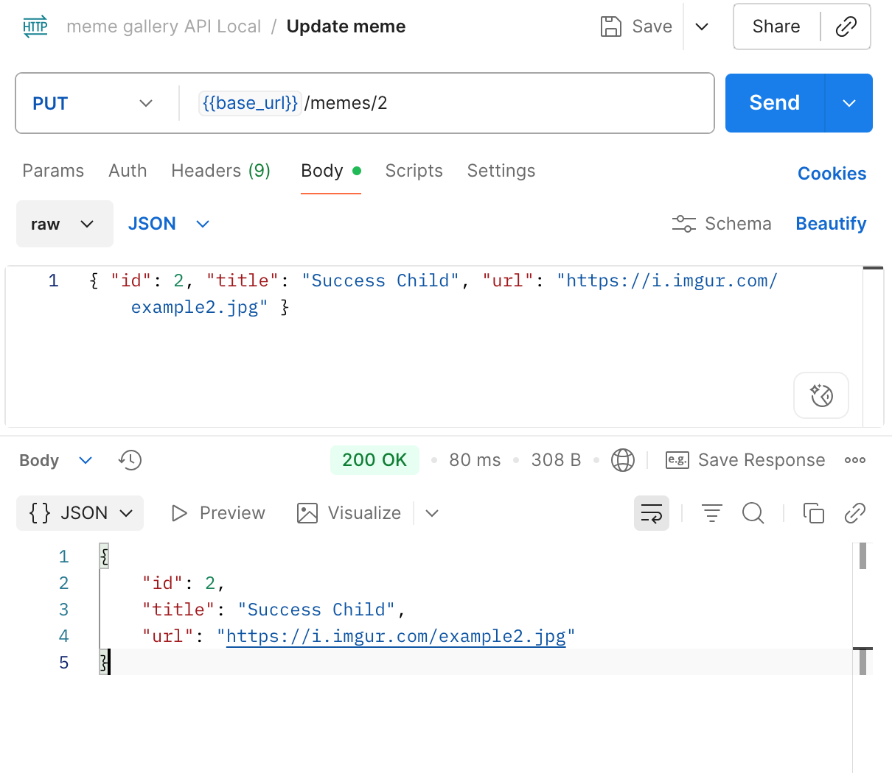
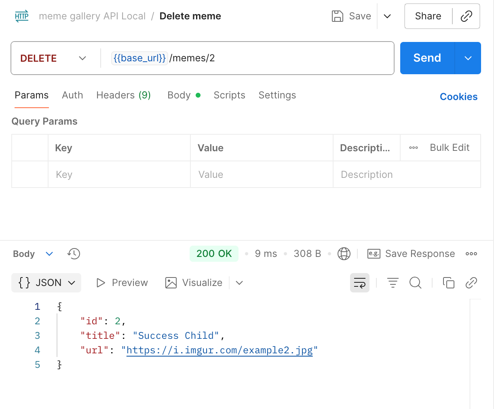

# meme-gallery-api

Setting up an Express server and creating API endpoints using ES6+ features.

## GET memes 

## POST memes

## GET meme by ID

## GET meme by ID error 

## Error test

## Terminal log requests

## UPDATE meme 

## DELETE meme

