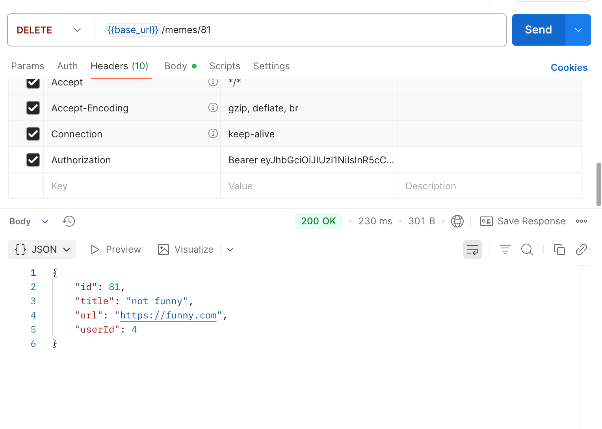

# Meme Gallery API

A private CRUD API that allows users to register, log in, and manage memes — including creating, updating, liking/unliking, and deleting them.

**Author:** Katarina Andrews

- **[Deployment URL](https://meme-gallery-api-4pmz.onrender.com/)**
- **[API Docs](https://meme-gallery-api-4pmz.onrender.com/docs)**

## Project Overview

### Steps

1. **Initialize Project**

   - Installed Express `npm install express`
   - Added seed data for initial testing
   - Created routes meme operations
   - Implemented middleware for request logging and error handling

2. **Set Up Database**

   - Created a **PostgreSQL** database on **AWS RDS**
   - Installed and configured Prisma
     ```
     npm install prisma --save-dev
     npm install @prisma/client
     npx prisma init
     ```
   - Added the PostgreSQL connection URL and Port to the `.env` file 
     ```
     DATABASE_URL=your_postgres_rds_connection_url
     PORT=3000
     ```
   - Integrated Prisma into the project for database access and migrations

3. **Implement Authentication**

   - Installed authentication dependencies `npm install bcrypt jsonwebtoken`
   - Implemented **JWT-based authentication**
   - Created user registration and login routes
   - Added authentication middleware to protect restricted routes
   - Added JWT to `.env` file `JWT_SECRET=your_jwt_secret`

4. **Extra Features**

   - Implemented the **“like/unlike meme”** feature
   - Installed **Joi** for input validation `npm install joi`

5. **TypeScript Integration**

   - Refactored parts of the codebase from JavaScript to TypeScript
   - Added TypeScript interfaces for stronger type safety and cleaner code

6. **Deployment**
   - Deployed the backend API on **Render** for production hosting
   - Added API key
   - Added API docs `npm install express-jsdoc-swagger`


### How to run

```
"scripts": {
  "start": "node dist/index.js",
  "dev": "nodemon --loader ts-node/esm src/index.js",
  "build": "tsc -p tsconfig.json"
}
```

## Routes

**Auth Routes**

POST `/auth/register`

- Register a new user.


Error


POST `/auth/login`

- Authenticate user and return a JWT token.


**Meme Routes**

GET `/memes`

- Retrieve all memes.

GET `/memes/:id`

- Retrieve a specific meme by ID.

GET `/memes/users/:id/memes`

- Retrieve all memes created by a specific user.

POST `/memes`

- Create a new meme (requires JWT).


Error


PUT `/memes/:id`

- Update a meme (requires JWT).


Error


DELETE `/memes/:id`

- Delete a meme (requires JWT).



Error


POST `/memes/:id/like`

- Like or unlike a meme (requires JWT).

## Tech Used

- Express.js
- Node.js
- Javascript
- TypeScript
- Prisma
- PostgreSQL (AWS RDS)
- bcrypt
- JWT
- Joi
- Swagger
